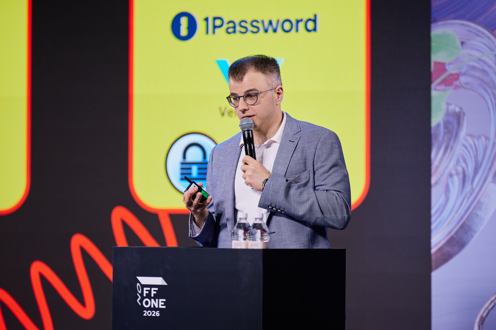
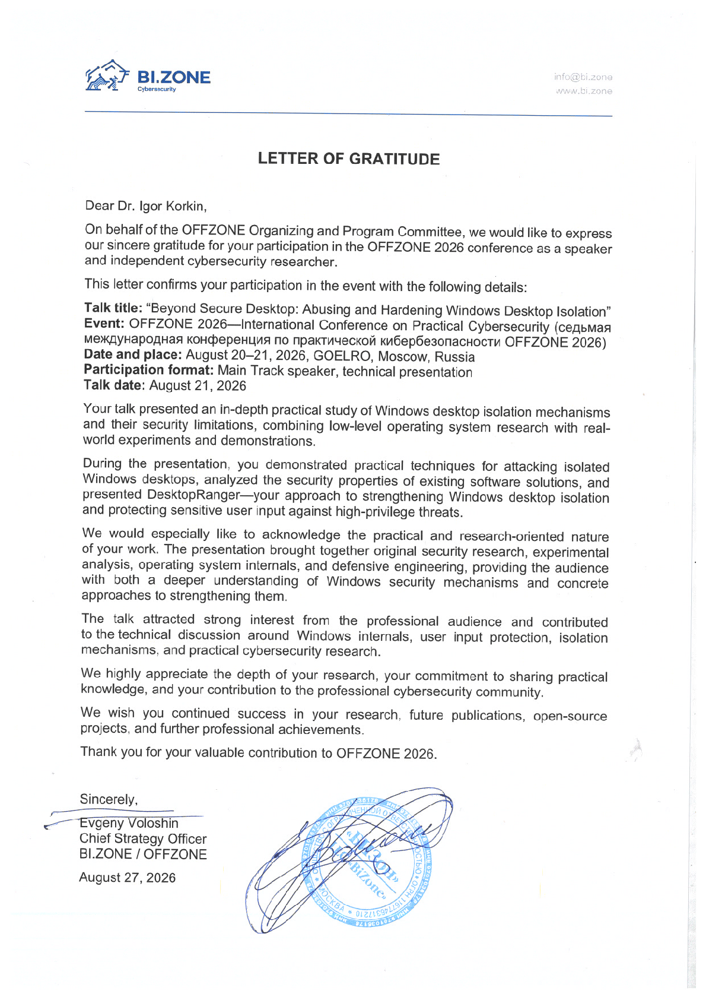

# OFFZONE 2026 | Beyond Secure Desktop: Abusing and Hardening Windows Desktop Isolation

<!-- markdownlint-disable MD033 -->

  
  

<!-- markdownlint-enable MD033 -->

## Talk

* **Titles:**
  * **English:** Beyond Secure Desktop: Abusing and Hardening Windows Desktop Isolation
  * **Russian:** Практический анализ безопасности Windows Desktop: атаки кейлоггеров и способы защиты
* **Speaker:** Igor Korkin
* **Event:** OFFZONE 2026 — Seventh International Conference on Practical Cybersecurity
* **Organizer:** BI.ZONE
* **Type:** Conference presentation
* **Track:** Main Track
* **Level:** HARD
* **Date:** August 21, 2026
* **Time:** 15:00–16:00
* **Venue:** GOELRO
* **Location:** Moscow, Russia
* **Language:** Russian
* [OFFZONE 2026](https://offzone.moscow/eng/)
* [DesktopRanger on GitHub](https://github.com/IgorKorkin/DesktopRanger)
* [Letter of Gratitude from BI.ZONE (OFFZONE)](./OFFZONE-2026-conference-Letter-of-Gratitude.pdf)

## Official Materials / Официальные материалы

* [Official talk page — English](https://offzone.moscow/eng/program/beyond-secure-desktop-abusing-and-hardening-windows-desktop-isolation/)
* [Официальная страница доклада — Русский](https://offzone.moscow/program/beyond-secure-desktop-abusing-and-hardening-windows-desktop-isolation/)

### Official Abstract — English

Running sensitive applications on a separate Windows Desktop is often treated as a reliable security boundary. The talk demonstrates practical attacks in which keyloggers abuse Windows Desktop isolation to intercept user keystrokes. It then introduces DesktopRanger, an open-source project that creates a hardened desktop through restrictive access control.

### Официальная аннотация — Русский

Запуск приложений, работающих с конфиденциальными данными, на отдельном Windows Desktop часто рассматривается как надежное решение по безопасности. В докладе демонстрируются практические атаки, в которых кейлоггеры используют недостатки Windows Desktop для перехвата нажатий клавиш. Затем представлен DesktopRanger — открытый проект, создающий защищенный рабочий стол за счет управления доступом к объектам Windows Desktop.

## Abstract

Running applications that handle sensitive data on a separate Windows Desktop is often treated as a reliable security boundary. The talk demonstrates practical attacks in which keyloggers abuse weaknesses in Windows Desktop isolation to intercept user keystrokes. It then introduces DesktopRanger, an open-source project that creates a hardened desktop through restrictive access control to Windows Window Station and Desktop objects.

## Аннотация

Запуск приложений, работающих с конфиденциальными данными, на отдельном Windows Desktop часто рассматривается как надежная граница безопасности. В докладе демонстрируются практические атаки, в которых кейлоггеры используют слабые стороны изоляции Windows Desktop для перехвата пользовательского ввода. Затем представлен DesktopRanger — проект с открытым исходным кодом, создающий защищенный рабочий стол за счет строгого управления доступом к объектам Window Station и Desktop в Windows.

## Extended Summary

Windows Desktop isolation can separate a sensitive application's user interface from the default interactive desktop, but the isolation boundary depends on access control to Window Station and Desktop objects. A sufficiently privileged user-mode attacker may still discover desktop objects, open them, relaunch code on a target desktop, or apply input-capture techniques from inside the target context.

The talk examines practical keyboard-input interception techniques including `SetWindowsHookEx`, `GetAsyncKeyState`, Raw Input, and DirectInput, and discusses how desktop enumeration, object access rights, and process placement affect the attack surface. The analysis also considers real-world secure-desktop implementations and the difference between hiding a desktop, restricting selected capabilities, and enforcing a restrictive access policy on the desktop object itself.

DesktopRanger demonstrates a sandbox-driven approach to protecting sensitive keyboard input without kernel hooks or continuous interception. The prototype creates a dedicated desktop, restricts access to the Window Station and Desktop objects, temporarily grants only the permissions required to launch a trusted process, and then returns the desktop to its protected state. Experiments on Windows 11 x64 evaluate attacks from regular-user, administrator, and `NT AUTHORITY\SYSTEM` contexts.

The main conclusion is that a separate Windows Desktop should not be treated as a security boundary by itself: the effective boundary is the access policy applied to the underlying Windows objects.

## Расширенное описание

Изоляция Windows Desktop позволяет отделить интерфейс приложения, работающего с конфиденциальными данными, от стандартного интерактивного рабочего стола, однако реальная граница изоляции определяется политикой доступа к объектам Window Station и Desktop. Нарушитель с достаточно высокими привилегиями в user mode может обнаруживать Desktop-объекты, открывать их, запускать код на целевом рабочем столе или применять техники перехвата ввода уже из его контекста.

В докладе рассматриваются практические техники перехвата клавиатурного ввода с использованием `SetWindowsHookEx`, `GetAsyncKeyState`, Raw Input и DirectInput, а также влияние перечисления рабочих столов, прав доступа к объектам и размещения процессов на поверхность атаки. Отдельно анализируются реальные реализации secure desktop и различие между сокрытием рабочего стола, ограничением отдельных возможностей и строгой политикой доступа к самому объекту Desktop.

DesktopRanger демонстрирует sandbox-driven подход к защите конфиденциального клавиатурного ввода без драйверов ядра и постоянного перехвата событий. Прототип создает отдельный рабочий стол, ограничивает доступ к объектам Window Station и Desktop, временно предоставляет только права, необходимые для запуска доверенного процесса, после чего возвращает рабочий стол в защищенное состояние. Эксперименты в Windows 11 x64 рассматривают атаки из контекста обычного пользователя, администратора и `NT AUTHORITY\SYSTEM`.

Ключевой вывод состоит в том, что отдельный Windows Desktop сам по себе не должен рассматриваться как надежная граница безопасности: эффективной границей становится политика доступа, примененная к соответствующим объектам Windows.

## About OFFZONE 2026

OFFZONE 2026 was the seventh international conference on practical cybersecurity. The conference took place on August 20–21, 2026 at GOELRO in Moscow and brought together security specialists, developers, engineers, researchers, lecturers, and students. The program focused on technical and practical cybersecurity content, including real attack scenarios, vulnerability research, and defensive technologies.

## Об OFFZONE 2026

OFFZONE 2026 — седьмая международная конференция по практической кибербезопасности. Конференция прошла 20–21 августа 2026 года в пространстве GOELRO в Москве и объединила специалистов по информационной безопасности, разработчиков, инженеров, исследователей, преподавателей и студентов. Программа была посвящена техническим и практическим вопросам кибербезопасности, включая реальные сценарии атак, исследования уязвимостей и защитные технологии.

## How to Cite / Как цитировать

### ГОСТ

<!-- markdownlint-disable MD033 -->
<table>
<tr>
<td>
Коркин И. Ю. Практический анализ безопасности Windows Desktop: атаки кейлоггеров и способы защиты : доклад на VII Международной конференции по практической кибербезопасности OFFZONE 2026, Москва, 21 августа 2026 г.
</td>
</tr>
</table>
<!-- markdownlint-enable MD033 -->

### APA 7

<!-- markdownlint-disable MD033 -->
<table>
<tr>
<td>
Korkin, I. (2026, August 21). <em>Beyond Secure Desktop: Abusing and hardening Windows Desktop isolation</em> [Conference presentation]. OFFZONE 2026: Seventh International Conference on Practical Cybersecurity, Moscow, Russia.
</td>
</tr>
</table>
<!-- markdownlint-enable MD033 -->

<!-- markdownlint-disable MD033 -->

  

<!-- markdownlint-enable MD033 -->
