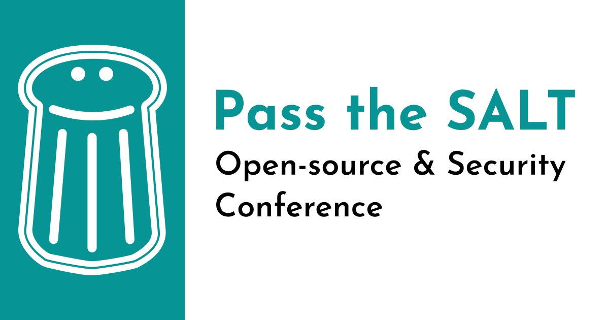
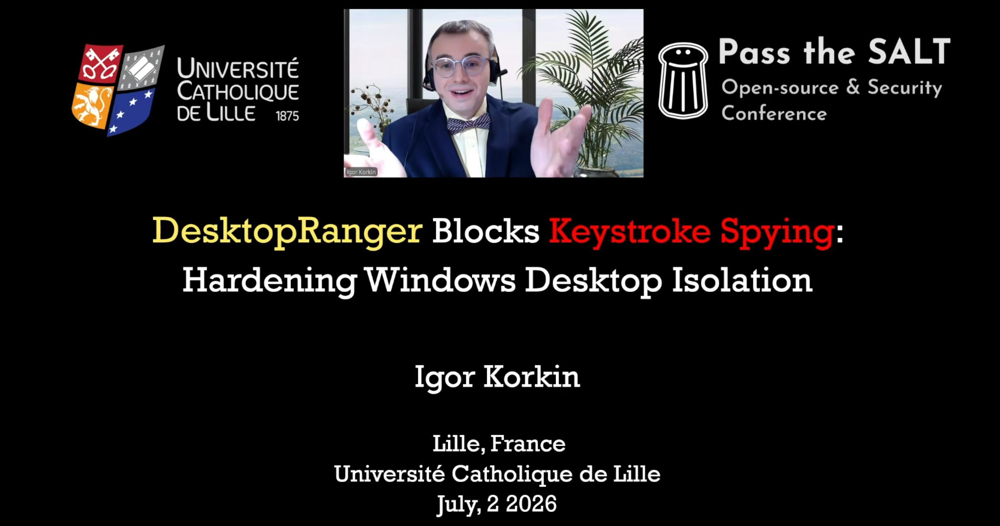
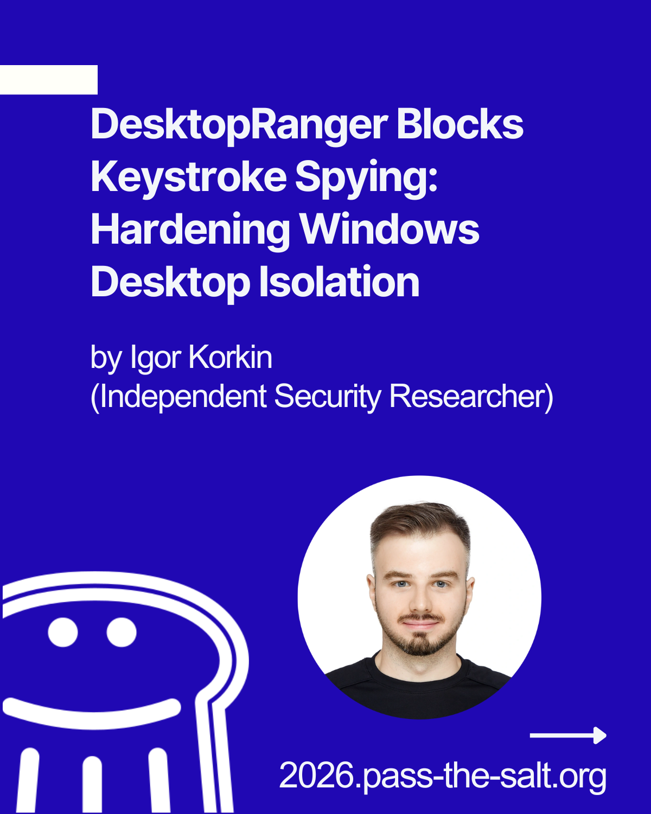
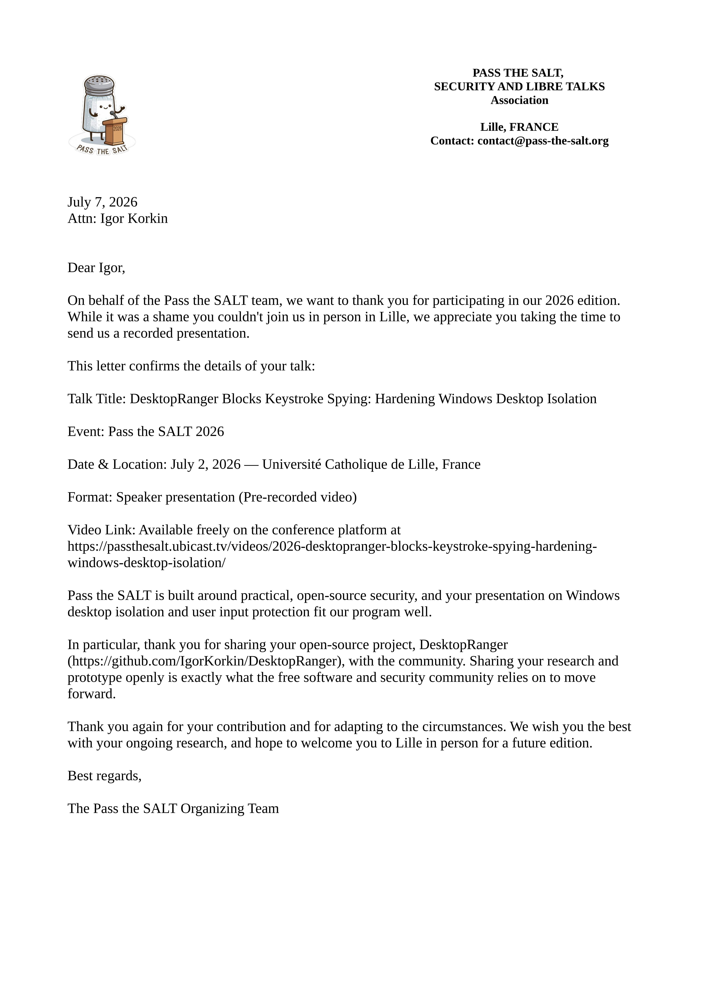

# Pass the SALT 2026 | DesktopRanger

  
  
   
    

## Talk

* **Title:** DesktopRanger Blocks Keystroke Spying: Hardening Windows Desktop Isolation
* **Speaker:** Igor Korkin
* **Event:** Pass the SALT 2026
* **Date:** July 2, 2026
* **Location:** Université Catholique de Lille, Lille, France
* **Format:** Conference presentation
* **Language:** English
* **Full Recorded Talk:** [▶ Watch on Ubicast](https://passthesalt.ubicast.tv/videos/2026-desktopranger-blocks-keystroke-spying-hardening-windows-desktop-isolation/)
* **Brief:** The talk demonstrates how privileged user-mode keyloggers can attack isolated Windows desktops and presents **DesktopRanger**—an open-source prototype that hardens Window Station and Desktop access control to protect sensitive keyboard input.

## Citation

### ГОСТ

Коркин И. Ю. DesktopRanger Blocks Keystroke Spying: Hardening Windows Desktop Isolation : доклад на конференции Pass the SALT 2026, Лилль, Франция, 2 июля 2026 г. URL: https://github.com/IgorKorkin/research/tree/main/2026/Pass-the-SALT-2026-conference (дата обращения: ДД.ММ.ГГГГ).

### APA 7

Korkin, I. (2026, July 2). *DesktopRanger blocks keystroke spying: Hardening Windows Desktop isolation* [Conference presentation]. Pass the SALT 2026, Lille, France. https://github.com/IgorKorkin/research/tree/main/2026/Pass-the-SALT-2026-conference

## Official Conference Promo Posts

* [LinkedIn](https://www.linkedin.com/posts/pass-the-salt-conference_pts2026-security-by-design-session-activity-7472606299772497920-Sx0n)
* [Infosec.Exchange](https://infosec.exchange/@passthesaltcon/116759478471206454)
* [X / Twitter](https://x.com/passthesaltcon/status/2066842363641618561)

## Open-Source Project

* [DesktopRanger on GitHub](https://github.com/IgorKorkin/DesktopRanger)

## Additional Materials

* Official participation letter ([View PDF](letter_igor_korkin.pdf))

  

