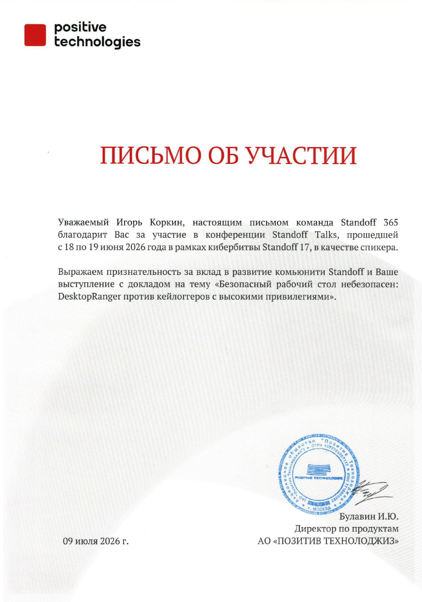

# StandOff Talks 2026 | Secure Desktop is not Secure

<!-- markdownlint-disable MD033 -->

  
  

<!-- markdownlint-enable MD033 -->

## Talk

* **Titles:**
  * **English:** Secure Desktop is not Secure: DesktopRanger Against High-Privilege Keyloggers
  * **Russian:** Не такой уж Secure Desktop: как DesktopRanger противостоит привилегированным кейлоггерам
  * **Alternative Russian title:** Безопасный рабочий стол небезопасен: DesktopRanger против кейлоггеров с высокими привилегиями
* **Speaker:** Igor Korkin
* **Event:** StandOff Talks 2026
* **Type:** Conference presentation
* **Date:** June 18, 2026
* **Location:** Moscow, Russia
* **Language:** Russian
* [Watch on YouTube](https://www.youtube.com/watch?v=JwTZBnUFuek&list=PLPRuLqtaT63c&index=14)
* [Watch on RuTube](https://rutube.ru/video/bce4a072dea4eadf58cb9501e07935b1/?playlist=1694167)
* [Watch on VK Video](https://vkvideo.ru/video-227564222_456239239?pl=-227564222_15)
* [DesktopRanger on GitHub](https://github.com/IgorKorkin/DesktopRanger)
* [StandOff Talks media archive](https://storage.ptsecurity.com/d/4686c3b14a0c42f0b062/?p=%2F18%20%D0%B8%D1%8E%D0%BD%D1%8F&mode=list)
* [Official participation letter](./letter_igor_korkin_STF-Talks.pdf)

## Abstract

Windows Desktop isolation moves sensitive keyboard input away from the Default desktop and protects it from basic keyloggers. However, privileged user-mode processes can enumerate desktops, open them by name, switch to a target desktop, or launch a helper process inside it.

The talk reviews attacks based on `SetWindowsHookEx`, `GetAsyncKeyState`, `Raw Input`, `DirectInput`, Desktop-object enumeration, and cross-desktop process relaunch. It also presents DesktopRanger, an open-source prototype that strengthens Window Station and Desktop access control through a restrictive security descriptor, desktop-enumeration restrictions, and controlled trusted-application launch.

Experiments on Windows 11 x64 show that DesktopRanger blocks interception of a test password phrase by all implemented techniques when the keylogger runs as a regular user, administrator, or `NT AUTHORITY\SYSTEM`.

## Описание доклада

Механизм Windows Desktop позволяет перенести ввод конфиденциальных данных с Default Desktop на отдельный рабочий стол, однако защищает его преимущественно от базовых кейлоггеров. Привилегированные процессы могут перечислять рабочие столы, открывать их по имени, переключаться на целевой рабочий стол или запускать на нём собственный процесс.

В докладе рассматриваются атаки с применением `SetWindowsHookEx`, `GetAsyncKeyState`, `Raw Input`, `DirectInput`, перечисления Desktop-объектов и перезапуска процесса на других рабочих столах. Представлен DesktopRanger — open-source прототип, усиливающий разграничение доступа к объектам Window Station и Desktop с помощью ограничительного дескриптора безопасности, запрета перечисления защищённых рабочих столов и контролируемого запуска доверенных приложений.

Эксперименты в Windows 11 x64 показали, что DesktopRanger блокирует перехват тестовой парольной фразы всеми реализованными техниками при запуске кейлоггера от имени пользователя, администратора и `NT AUTHORITY\SYSTEM`.

## How to Cite

### ГОСТ

<!-- markdownlint-disable MD033 -->
<table>
<tr>
<td>
Коркин И. Ю. Не такой уж Secure Desktop: как DesktopRanger противостоит привилегированным кейлоггерам : доклад на конференции StandOff Talks 2026, Москва, 18 июня 2026 г.
</td>
</tr>
</table>
<!-- markdownlint-enable MD033 -->

### APA 7

<!-- markdownlint-disable MD033 -->
<table>
<tr>
<td>
Korkin, I. (2026, June 18). Secure desktop is not secure: DesktopRanger against high-privilege keyloggers [Conference presentation]. StandOff Talks 2026, Moscow, Russia.
</td>
</tr>
</table>
<!-- markdownlint-enable MD033 -->

<!-- markdownlint-disable MD033 -->

  

<!-- markdownlint-enable MD033 -->